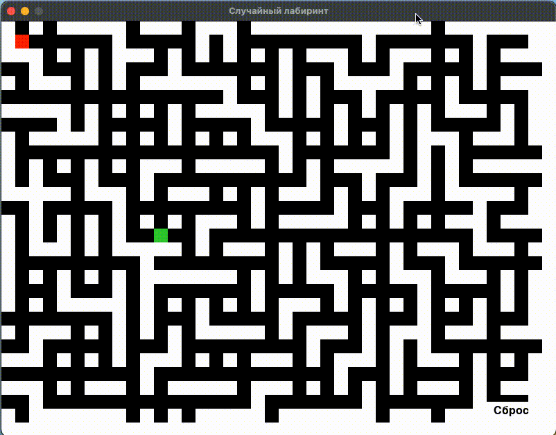

### Игра в случайные лабиринты с использованием Pygame

Данный код реализует простую игру в лабиринты с использованием библиотеки Pygame.
Код генерирует случайные лабиринты и позволяет игроку перемещаться по ним с помощью стрелок на клавиатуре.
Цель игры — достичь зеленой конечной точки на каждом уровне, сложность лабиринта увеличивается по мере продвижения
игрока по уровням.

### Компоненты Кода:

1. **Импорты:**
    - Модуль `enum` используется для создания класса перечислений.
    - Модуль `random` используется для генерации случайных чисел и выборов.
    - Модуль `typing` используется для подсказок типов.
    - Библиотека `pygame` используется для создания графики.

2. **Константы:**
    - `width` и `height`: Размеры игрового окна.
    - `cell_size`: Размер каждой ячейки в лабиринте.
    - Кортежи RGB, представляющие используемые цвета в игре.

3. **Перечисление - Direction (Направление):**
    - Класс перечислений `Direction` определяет возможные направления движения (вверх, вниз, влево, вправо).

4. **Класс - Player (Игрок):**
    - Представляет позицию игрока в лабиринте.
    - Конструктор инициализирует позицию игрока.
    - Метод `move()` обновляет позицию игрока на основе указанного направления, если новая позиция допустима в
      лабиринте.
    - Метод `draw()` отображает персонажа игрока на экране.
    - Метод `reset_player()` позволяет сбросить позицию игрока на заданные координаты.

5. **Класс - Maze (Лабиринт):**
    - Представляет структуру лабиринта и логику его генерации.
    - Конструктор инициализирует размеры лабиринта, структуру лабиринта и координаты конечной точки.
    - Метод `initialize_maze()` инициализирует начальное состояния лабиринта.
    - Метод `generate()` генерирует лабиринт со стенами и путями на основе плотности и текущего уровня.
    - Метод `reset_maze()` сбрасывает состояние лабиринта к начальному перед генерацией нового уровня.
    - Метод `carve_paths()` рекурсивно прокладывает пути в лабиринте.
    - Метод `draw()` отображает лабиринт на экране.

6. **Главная Функция:**
    - Инициализирует Pygame и настраивает игровое окно.
    - Определяет уровни сложности и текущий уровень.
    - Создает экземпляр класса `Maze` и генерирует начальный лабиринт.
    - Создает экземпляр класса `Player`.
    - Создает объект `reset_button_rect` для кнопки Reset.
    - Игровой цикл выполняется, пока игрок не достигнет конечной точки или не закроет окно игры.
    - Цикл обрабатывает пользовательский ввод, обновляет состояние игры и отображает лабиринт и игрока на экране.
    - Когда игрок достигает конца уровня, игра переходит к следующему уровню или завершается, если все уровни пройдены.
    - При нажатии кнопки Reset лабиринт и игрок отрисовываются заново, сохраняя текущий уровень.
    - Игровой цикл завершается, когда игрок завершает все уровни или закрывает окно игры.
    - Очищает ресурсы Pygame перед завершением.

7. **Исполнение:**
    - Код выполняется только при прямом запуске скрипта (не при импорте как модуля).
    - Для запуска игры вызывается функция `main()`.

Соответствует [PEP8](https://peps.python.org/pep-0008/) и принципу [KISS](https://ru.wikipedia.org/wiki/KISS_(принцип)).

---

### Класс - Player (Игрок):

> Метод `__init__()` выполняет инициализацию объекта игрока при его создании. Он определяет начальные координаты игрока
> в лабиринте.

1. **Параметры метода:**
    - `x` (int): Начальная координата x игрока.
    - `y` (int): Начальная координата y игрока.

2. **Инициализация параметров:**
    - Метод начинает с сохранения переданных параметров `x` и `y` как атрибуты класса.
    - `self.x` и `self.y` инициализируются значениями, указанными в аргументах.

3. **Итог:**
    - Метод `__init__()` при создании объекта класса `Player` инициализирует начальные координаты игрока в лабиринте.
      Эти координаты будут использоваться для отслеживания позиции игрока во время игры.

> Метод `move()` в классе `Player` отвечает за перемещение игрока в лабиринте в указанном направлении.

1. **Параметры метода:**
    - `direction` (Direction): Объект перечисления `Direction`, представляющий выбранное направление
      (UP, DOWN, LEFT, RIGHT).
    - `maze` (List[List[int]]): Двумерный список, представляющий структуру лабиринта.

2. **Определение смещения:**
    - Метод получает смещение `(dx, dy)` из объекта направления `direction` с помощью выражения `direction.value`.

3. **Проверка допустимости перемещения:**
    - Метод проверяет, что новые координаты после перемещения не выходят за границы лабиринта.
      Для этого он проверяет, что `self.x + dx` находится в допустимом диапазоне от 0 до ширины лабиринта минус 1
      (`maze_width - 1`), и аналогично для `self.y + dy` и высоты лабиринта.

4. **Проверка проходимости клетки:**
    - Далее метод проверяет, что клетка, в которую игрок пытается переместиться, является проходимой.
      Он использует значение в матрице лабиринта `maze[self.y + dy][self.x + dx]`. Если значение равно 0, это означает,
      что клетка проходима.

5. **Обновление координат игрока:**
    - Если обе проверки проходят успешно, то метод обновляет координаты игрока `self.x` и `self.y`, добавляя к текущим
      координатам значения смещения `(dx, dy)`. Это фактически перемещает игрока в указанном направлении.

6. **Итог:**
    - Метод `move()` в классе `Player` позволяет игроку перемещаться внутри лабиринта в зависимости от выбранного
      направления. Он проверяет допустимость перемещения и проходимость клетки перед обновлением координат игрока.
      Это важная часть игрового процесса, которая обеспечивает взаимодействие игрока с окружающим миром.

> Метод `draw()` в классе `Player` отвечает за отображение игрока на экране с использованием библиотеки Pygame.

1. **Параметры метода:**
    - `screen` (Any): Экран Pygame, на котором будет отображаться игрок.

2. **Отображение игрока:**
    - Метод использует функцию `pygame.draw.rect()` для отрисовки прямоугольника, который будет представлять игрока на
      экране.
    - Аргументы функции `pygame.draw.rect()` задают следующие параметры:
        - `screen`: Экран, на котором будет производиться отрисовка.
        - `red`: Цвет прямоугольника (красный) в формате RGB.
        - `(self.x * cell_size, self.y * cell_size)`: Координаты верхнего левого угла прямоугольника, рассчитанные на
          основе текущих координат игрока `self.x` и `self.y`, а также размера клетки `cell_size`.
        - `cell_size x cell_size`: Размеры прямоугольника в пикселях, соответствующие размеру одной клетки.

3. **Итог:**
    - Метод `draw()` в классе `Player` выполняет отрисовку игрока на экране. Он использует функцию `pygame.draw.rect()`
      для создания красного прямоугольника, который представляет игрока в текущей позиции в лабиринте. Это позволяет
      визуально отображать позицию игрока и его перемещение по лабиринту во время игры.

> Метод `reset_player()` в классе `Player` позволяет сбросить позицию игрока на заданные координаты.

1. **Параметры метода:**
    - `x` (int): Новая координата X, на которую будет сброшена позиция игрока.
    - `y` (int): Новая координата Y, на которую будет сброшена позиция игрока.

2. **Сброс позиции игрока:**
    - Метод принимает два аргумента, `x` и `y`, они представляют новые координаты, на которые нужно переместить
      игрока.
    - Внутри метода происходит присвоение переданных значений `x` и `y` атрибутам `self.x` и `self.y` соответственно.
    - Это обновление значений координат `x` и `y` на новые значения, что изменяет текущую позицию игрока на экране.

3. **Использование метода:**
    - Обычно этот метод вызывается после события "сброс" (например, нажатие кнопки "Reset") для перемещения игрока на
      заданные начальные координаты. Это может быть полезно, чтобы вернуть игрока в исходное положение при начале нового
      уровня или после сброса состояния игры.

4. **Итог:**
    - Метод `reset_player()` класса `Player` позволяет изменить текущую позицию игрока на новые координаты `x` и `y`.
      Этот метод полезен для переноса игрока на определенные позиции, например, в начальное положение после сброса игры
      или
      начала нового уровня.

---

### Класс - Maze (Лабиринт):

> Метод `__init__()` выполняет инициализацию объектов этого класса при их создании.
> В данном методе определяются начальные параметры и состояния объекта `Maze`.

1. **Параметры метода:**
    - `maze_width` (int): Ширина лабиринта в клетках.
    - `maze_height` (int): Высота лабиринта в клетках.

2. **Инициализация параметров:**
    - Метод начинает с сохранения переданных параметров `maze_width` и `maze_height` в атрибуты класса для дальнейшего
      использования.
    - `self.width` и `self.height` инициализируются значениями, указанными в аргументах.

3. **Инициализация структуры лабиринта:**
    - Создается двумерный список `self.maze`, который представляет матрицу лабиринта. Изначально он будет заполнен
      значениями 1, представляющими стены.

4. **Инициализация конечной точки:**
    - Инициализируются атрибуты `self.end_x` и `self.end_y` нулевыми значениями. Они будут использованы для хранения
      координат конечной точки лабиринта.

5. **Итог:**
    - Метод `__init__()` при создании объекта класса `Maze` устанавливает начальные значения атрибутов, которые будут
      использоваться при генерации и отображении лабиринта. Это обеспечивает базовую конфигурацию объекта класса перед
      его
      дальнейшим использованием.

> Метод `initialize_maze()` используется для инициализации начального состояния лабиринта, создания пустой сетки с
> определенными размерами.

1. **Логика инициализации:**
    - Внутри метода создается двумерный список `maze` размером `self.height` на `self.width`, который представляет сетку
      лабиринта.
    - Каждый элемент списка `maze` инициализируется значением `1`, что означает стену в лабиринте.

2. **Использование метода:**
    - Этот метод может быть вызван при начале игры или перед генерацией лабиринта. Он создает пустую сетку, которая
      будет использоваться для генерации структуры лабиринта.

3. **Итог:**
    - Метод `initialize_maze()` класса `Maze` создает начальное состояние лабиринта в виде двумерного списка с
      определенными размерами. Этот метод создает пустую сетку, которая будет использоваться в дальнейшем для генерации
      и
      отображения лабиринта.

> Метод `generate()` в классе `Maze` отвечает за генерацию лабиринта с использованием случайных стен и путей.
> Он создает сложные структуры лабиринта, которые игрок должен будет пройти для достижения конечной точки.

#### Используется комбинация алгоритмов, в основном случайных перемещений и рекурсивного поиска в глубину, для создания лабиринта.

- [Depth-First Search](https://ru.wikipedia.org/wiki/Поиск_в_глубину)
- [Поиск с возвратом (Backtracking)](https://ru.wikipedia.org/wiki/Поиск_с_возвратом)
- [Maze generation algorithm](https://en.wikipedia.org/wiki/Maze_generation_algorithm)
- [Алгоритм Краскала](https://ru.wikipedia.org/wiki/Алгоритм_Краскала)
- [Алгоритм Прима](https://ru.wikipedia.org/wiki/Алгоритм_Прима)

1. `initialize_maze()`: Заполняет всю сетку лабиринта стенами (значение 1).

2. Цикл по нечетным индексам (как по x, так и по y) для создания начальных путей:
    - Этот шаг инициализирует каждую вторую ячейку лабиринта как открытый путь (значение 0). Таким образом, создается
      сетка стен с сеткой путей между ними.

3. Корректировка плотности:
    - Основываясь на `density` и `current_level`, добавляются пути между начальными путями. Цель здесь — создать более
      сложный лабиринт, добавляя пути в определенных направлениях.

4. Добавление корректированной плотности случайных путей:
    - Для каждой ячейки с нечетными индексами добавляется ряд случайных путей (в зависимости от `adjusted_density`) к
      соседним ячейкам.
    - Выбранные направления могут быть вверх, вниз, влево или вправо.
    - Эти пути создаются путем установки значений соседних ячеек в пути (0), но условные проверки гарантируют, что эти
      пути не пересекают существующие пути и не выходят за границы лабиринта.

5. Размещение выхода из лабиринта:
    - Выбирается случайная ячейка с нечетными индексами, которая становится выходом из лабиринта. Эйтет ячейке
      присваивается значение 0 для обозначения открытого пути.

6. `carve_paths(x, y)`: Этот метод, вероятно, представляет собой рекурсивный алгоритм "backtracking" (обратного
   отслеживания) для создания путей через лабиринт.
    - Для каждой ячейки выбирается случайное направление (вверх, вниз, влево или вправо).
    - Если перемещение в этом направлении возможно без нарушения границ лабиринта и без создания нового пути поверх
      существующего, ячейка между текущей ячейкой и целевой ячейкой устанавливается как путь (0), и рекурсия
      продолжается из целевой ячейки.

В целом данное решение объединяет начальное создание путей с нечетными индексами с процессом случайной генерации путей,
который избегает пересечения с существующими путями. Рекурсивный метод "backtracking" (`carve_paths`) добавляет
дополнительную сложность и связность к лабиринту, обеспечивая наличие одного пути от начала до выхода.

1. **Параметры метода:**
    - `density` (int): Плотность генерации путей в лабиринте. Чем выше значение, тем больше путей будет создано.
    - `current_level` (int): Текущий уровень сложности. Используется для настройки плотности генерации на разных
      уровнях.

2. **Инициализация матрицы лабиринта:**
    - Метод начинает с создания матрицы размером `height` x `width`, заполняя ее значениями 1, представляющими стены.

3. **Генерация основных путей:**
    - Для каждой второй строки `y` и каждой второй колонки `x` в матрице, метод устанавливает значение 0 (проходимая
      клетка) для создания начальных путей в лабиринте.

4. **Создание случайных путей:**
    - Для каждой второй строки `y` и каждой второй колонки `x` в матрице, метод случайным образом выбирает направление
      движения `(dx, dy)` из четырех возможных (верх, низ, влево, вправо).
    - Вычисляются новые координаты `(nx, ny)` для следующей клетки, добавляя к текущим координатам `(x, y)`
      смещение `(dx, dy)`.
    - Проверяется, что новые координаты `(nx, ny)` находятся внутри границ лабиринта и что клетка в выбранном
      направлении еще не посещена.
    - Если условия выполняются, метод устанавливает значение 0 для клетки `(nx, ny)` и создает путь между текущей и
      следующей клеткой, устанавливая значение 0 для клетки `(x + dx // 2, y + dy // 2)`.
    - Чем выше уровень сложности, тем меньше путей будет добавлено за одну итерацию, так как плотность уменьшается.

5. **Создание конечной точки:**
    - Выбираются случайные координаты `(end_x, end_y)` для конечной точки, гарантированно находящейся на нечетных
      строках и столбцах.
    - Значение 0 (проходимая клетка) устанавливается для конечной точки `(end_x, end_y)`.

6. **Вызов `carve_paths()`:**
    - Метод вызывает метод `carve_paths()` для прокладывания дополнительных путей между существующими путями, чтобы
      сделать лабиринт более сложным.

7. **Итог:**
    - Метод `generate()` создает случайный лабиринт, содержащий сложные структуры путей и стен. Путем управления
      параметром `density` и изменения уровня сложности, можно достичь разнообразных конфигураций лабиринта.

Этот метод является основной частью процесса генерации лабиринта, гарантирующей создание интересных и увлекательных
игровых пространств.

> Метод `reset_maze()` предназначен для сброса состояния лабиринта к начальному состоянию перед генерацией нового
> уровня.

1. **Сброс состояния:**
    - Внутри метода происходит сброс состояния лабиринта к начальному состоянию. Это достигается вызовом метода
      `initialize_maze()`, который заполняет сетку лабиринта стенами.

2. **Использование метода:**
    - Обычно этот метод вызывается перед началом генерации нового уровня лабиринта. Он позволяет обнулить состояние
      текущего лабиринта и подготовить его для генерации новой структуры.

3. **Итог:**
    - Метод `reset_maze()` класса `Maze` позволяет сбросить текущее состояние лабиринта к начальному, подготавливая его
      для генерации новой структуры на следующем уровне игры.

> Метод `carve_paths()` в классе `Maze` выполняет рекурсивное прокладывание путей в лабиринте, создавая дополнительные
> пути между
> существующими путями и клетками. Это помогает сделать лабиринт более сложным и интересным для игрока.

1. **Параметры метода:**
    - `x` (int): Текущая координата x, представляющая столбец в лабиринте.
    - `y` (int): Текущая координата y, представляющая строку в лабиринте.

2. **Основная идея:**
    - Метод начинает с текущей клетки `(x, y)` и выбирает случайным образом одно из четырех направлений
      (вверх, вниз, влево, вправо).
    - Если выбранное направление можно использовать для прокладывания пути (т.е. клетка в выбранном направлении еще не
      посещена и находится внутри границ лабиринта), то метод прокладывает путь, добавляя клетку между текущей и
      выбранной
      клеткой.

3. **Прокладывание путей:**
    - Для каждой итерации процесса выбирается случайное направление `(dx, dy)` из четырех доступных (верх, низ, влево,
      вправо).
    - Вычисляются новые координаты `(nx, ny)` для следующей клетки, добавляя к текущим координатам `(x, y)`
      смещение `(dx, dy)`.
    - Проверяется, что новые координаты находятся внутри границ лабиринта и что клетка в выбранном направлении еще не
      посещена.
    - Если все условия выполнены, то метод изменяет статус клетки `(nx, ny)` на проходимую (0) и клетку между текущей и
      следующей клеткой также делает проходимой, путем изменения статуса `(x + dx // 2, y + dy // 2)` на проходимую (0).
    - После этого, метод вызывает сам себя рекурсивно для новых координат `(nx, ny)`, чтобы продолжить прокладывать
      пути.

4. **Ограничения и выход из рекурсии:**
    - Рекурсия завершается, когда для текущей клетки не удается выбрать новое направление для прокладывания пути.
    - Это может произойти, если все направления вокруг текущей клетки уже использованы или находятся за границами
      лабиринта.

5. **Итог:**
    - Метод `carve_paths()` создает дополнительные проходы между существующими путями в лабиринте, делая его более
      интересным для игры. Рекурсивный процесс прокладывания путей происходит до тех пор, пока есть возможность
      продолжать создавать пути.

Этот метод является ключевой частью генерации сложных и разнообразных лабиринтов, что в свою очередь способствует
увлекательности игры.

> Метод `draw()` в классе `Maze` отвечает за отображение лабиринта на экране, используя библиотеку Pygame.
> Он рисует стены и пути лабиринта, а также отображает конечную точку.

1. **Параметры метода:**
    - `screen` (Any): Экран Pygame, на котором будет отображаться лабиринт.

2. **Очистка экрана:**
    - Сначала метод заполняет экран черным цветом с помощью функции `screen.fill(black)`. Это позволяет стирать
      предыдущий кадр и подготовить поверхность для новой отрисовки.

3. **Отображение стен и путей:**
    - С помощью вложенных циклов `for` метод проходит через каждую клетку лабиринта.
    - Если значение в текущей клетке `self.maze[y][x]` равно 1, это означает, что клетка представляет стену.
      В этом случае метод рисует белый прямоугольник на экране в соответствующей
      позиции `(x * cell_size, y * cell_size)`
      с размерами `cell_size x cell_size`.

4. **Отображение конечной точки:**
    - Затем метод рисует зеленый прямоугольник, представляющий конечную точку лабиринта, на экране в позиции
      `(self.end_x * cell_size, self.end_y * cell_size)` с размерами `cell_size x cell_size`.

5. **Обновление экрана:**
    - После отрисовки всех элементов, метод вызывает `pygame.display.flip()`, что приводит к обновлению отображения
      на экране. Таким образом, пользователь видит новый кадр, включая отрисованный лабиринт и конечную точку.

6. **Итог:**
    - Метод `draw()` выполняет отрисовку лабиринта на экране, включая стены, пути и конечную точку.
      Он использует информацию о структуре лабиринта, передаваемую через атрибут `self.maze`, и преобразует ее в
      графическое представление с помощью функций Pygame. Это позволяет игроку визуально взаимодействовать с игровой
      средой.

---

### Функция `main()`

> Является главной точкой входа в программу. Она инициализирует игровое окно, управляет основным игровым
> циклом и обеспечивает взаимодействие игрока с игрой. В этой функции создаются экземпляры объектов классов `Maze`
> и `Player`, генерируется и отображается лабиринт, а также обрабатываются события, такие как движение игрока и
> завершение
> игры.

1. **Инициализация Pygame и создание окна:**
    - Функция начинает с инициализации библиотеки Pygame вызовом `pygame.init()`.
    - Затем создается игровое окно с помощью `pygame.display.set_mode()`, устанавливая размер окна в соответствии с
      `width` и `height`, определенными в константах. Также устанавливается заголовок окна с названием игры.

2. **Инициализация уровней сложности:**
    - Определяется список словарей `levels`, представляющий разные уровни сложности. Каждый словарь содержит имя уровня
      и значение плотности генерации лабиринта.

3. **Инициализация лабиринта и игрока:**
    - Создается экземпляр класса `Maze` с указанием размеров лабиринта `width // cell_size` и `height // cell_size`.
    - Генерируется лабиринт с использованием метода `generate()` объекта `maze`, передавая плотность генерации и текущий
      уровень сложности.
    - Создается экземпляр класса `Player` с начальными координатами `(1, 1)`.

4. **Инициализация Pygame Clock и переменных:**
    - Создается экземпляр `clock` для отслеживания частоты кадров.
    - Инициализируется переменная `running` в значении `True`, чтобы начать игровой цикл.

5. **Игровой цикл:**
    - Внутри цикла происходит отслеживание событий Pygame и обработка игровой логики.
    - Вложенный цикл `for event in pygame.event.get()` перебирает все события, происходящие в игре.
    - Если событие - закрытие окна (`pygame.QUIT`), переменная `running` устанавливается в `False`, что приведет к
      завершению игрового цикла.

6. **Обработка времени:**
    - `current_time = pygame.time.get_ticks()`: получает текущее время в миллисекундах с использованием функции
      `pygame.time.get_ticks()`. Это позволяет отслеживать, сколько времени прошло с момента последнего изменения
      состояния игры.
    - `elapsed_time = current_time - last_move_time`: рассчитывает разницу между текущим временем и временем
      последнего изменения состояния игры (запоминается в переменной `last_move_time`). Это дает представление о том,
      сколько времени прошло с последнего движения игрока.
    - `if elapsed_time >= 1000 / speed`: сравнение прошедшего времени с интервалом, который определяется как
      `1000 / speed`, где `speed` - это скорость движения игрока. Если прошедшее время больше или равно этому интервалу,
      то это означает, что прошло достаточно времени для выполнения следующего шага игрока.

7. **Обработка движения игрока:**
    - `pygame.key.get_pressed()` получает состояние с клавиш клавиатуры.
    - Если клавиша `pygame.K_UP` нажата, то `dy` устанавливается на -1, что будет двигать игрока вверх.
    - Аналогично, если нажата клавиша `pygame.K_DOWN`, то `dy` устанавливается на 1, двигая игрока вниз.
    - Если нажата клавиша `pygame.K_LEFT`, то `dx` устанавливается на -1, двигая игрока влево.
    - Если нажата клавиша `pygame.K_RIGHT`, то `dx` устанавливается на 1, двигая игрока вправо.
    - Если нажатие клавиши соответствует направлению, игрок выполняет перемещение с использованием метода `move()`.

8. **Расчет новой позиции:**
    - Вычисление новой координаты `new_x` для горизонтальной позиции игрока, добавляя `dx` к текущей позиции игрока.
    - Аналогично, вычисление новой координаты `new_y` для вертикальной позиции игрока, добавляя `dy` к текущей позиции
      игрока.

9. **Проверка допустимости новой позиции:**
    - Проверка границ лабиринта и наличия пути (`maze.maze[new_y][new_x] == 0`) для новой позиции `new_x`, `new_y`.
    - Если все условия выполняются, то игрок перемещается на новую позицию, обновляя значения `player.x` и `player.y`.

10. **Проверка завершения уровня и игры:**
    - Если игрок достигает конечной точки лабиринта (`player.x == maze.end_x` и `player.y == maze.end_y`), проверяется,
      есть ли еще уровни сложности для прохождения.
    - Если уровни сложности остались, увеличивается переменная `current_level`, и лабиринт генерируется с новой
      плотностью и начальной позицией игрока. В противном случае игровой цикл завершается.

11. **Отрисовка элементов на экране:**
    - Экран заполняется черным цветом.
    - Лабиринт и игрок отрисовываются на экране с помощью методов `draw()`.

12. **Обновление экрана:**
    - После отрисовки всех элементов, вызывается `pygame.display.flip()`, чтобы обновить отображение на экране.

13. **Завершение игры:**
    - По завершении игрового цикла вызывается `pygame.quit()`, что завершает работу Pygame и закрывает окно.

14. **Итог:**
    - Функция `main()` объединяет все элементы игровой логики, включая инициализацию, генерацию лабиринта, обработку
      событий и отображение элементов на экране. Она создает интерактивное окружение для игрока и обеспечивает геймплей.

Файл `readme.md`
сгенерирован с помощью [ChatGPT](https://ru.wikipedia.org/wiki/ChatGPT) / [OpenAI ChatGPT-3.5](https://chat.openai.com)
